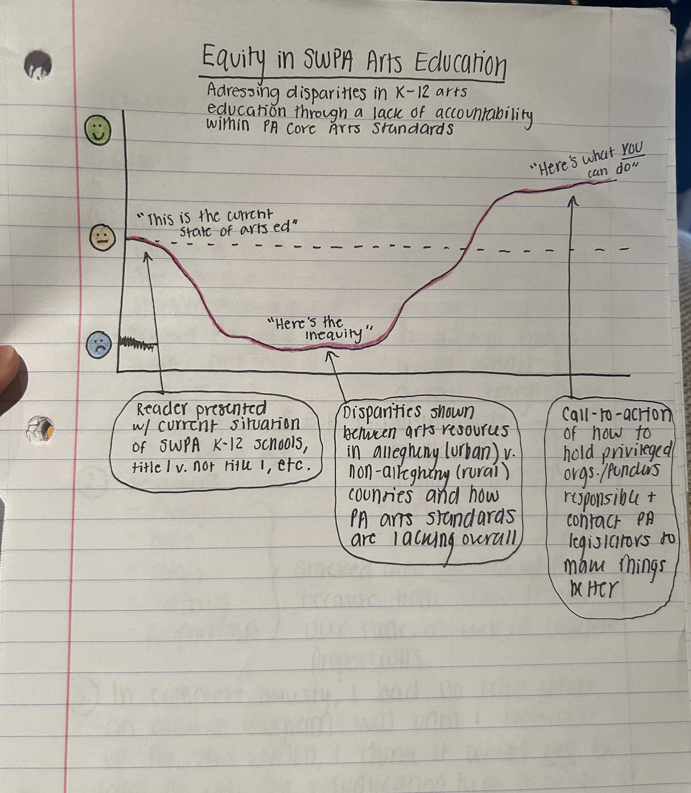
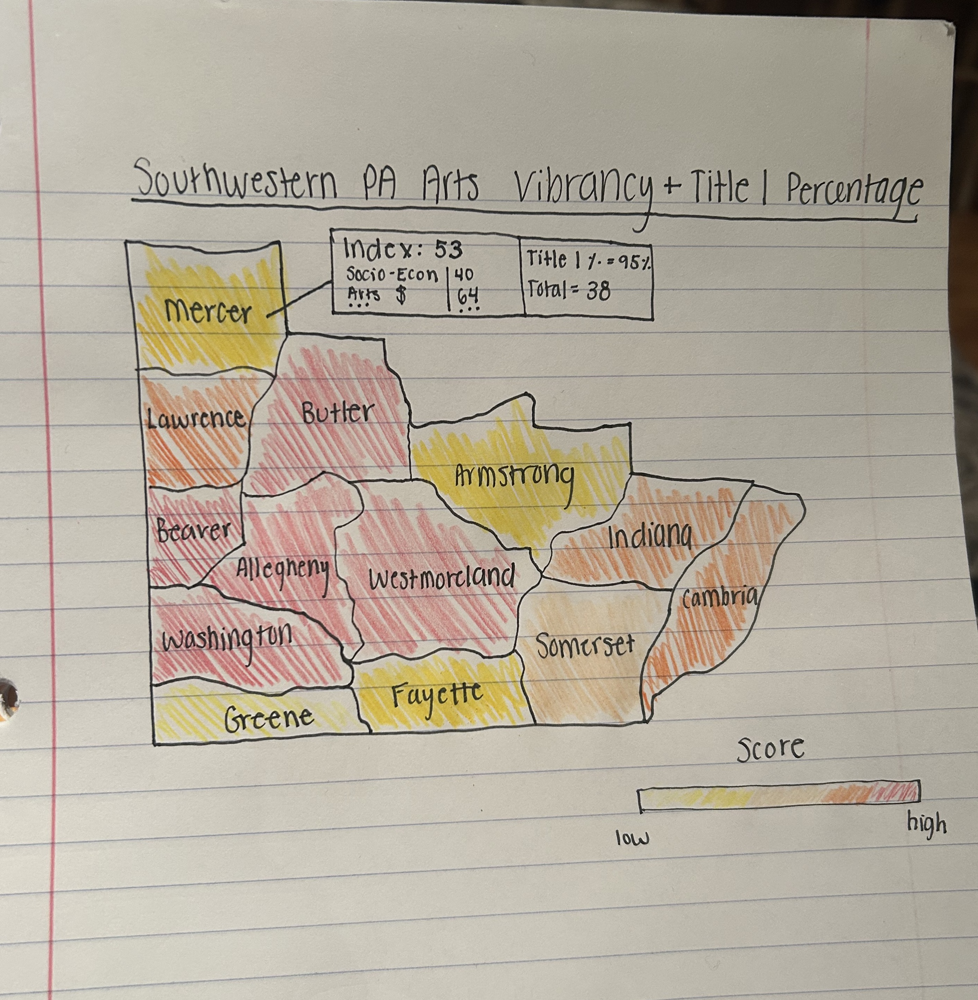
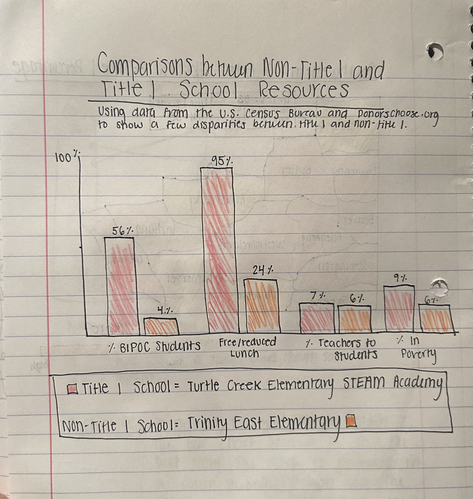

| [Main Page](/README.md) | 

# Final Project Part 1
## Project Outline: K-12 Arts Education Disparities in Pennsyvania
> This final project looks at the large disparities that exist with K-12 arts education in Pennsylvania, specifically focusing on the Southwestern region of Pennsylvania. I was inspired to focus my project on this topic due to my current involvement in a Systems Synthesis project for Carnegie Mellon University that is working with Arts Education Collaborative's initiative known as artlook SWPA, an online database that serves as a robust tool for artists, arts educators, and arts organizations. I found that after working on this project for the entire Fall semester, I have grown increasingly passionate about arts education in Pennsylvania, and was absolutely shocked to find out the disparities that exist between Title I/Non-Title I school resources, as well as Urban/Non-Urban arts organization resources. Overall, I acknowledge that this undertaking may be slightly tricky because I need to maintain the confidential information that was given to us by our client while still telling a meaningful, untold story... as there is plenty of valuable information to tell and I feel it is important that it be shared.

> Southwestern Pennsylvania consists of 13 counties and artlook® SWPA currently extends its potential reach to all of those 13: Allegheny, Armstrong, Beaver, Butler, Cambria, Fayette, Greene, Indiana, Lawrence, Mercer, Somerset, Washington, and Westmoreland. To better understand the differences between each respective county, our Systems team utilized the 2022 SMU Data Arts Vibrancy Map, which is a visual, interactive tool that describes the arts vibrancy of various counties throughout the United States based on the following five metrics: Arts Providers, Arts Dollars, Government Support, Socio-Economic Status, Other Leisure. The vibrancy score is based on an index from 0-100, with a 100 being a perfect arts vibrancy score, comparable to New York City, for example. In general, the more arts-rich and/or “well-off” the county is, the higher the index score will be. > Most of the counties within Southwestern Pennsylvania land within the 70-89 Arts Vibrancy index range. It is also notable that arts funding and socio-economic status show large disparities between the counties. Many residents of the all encompassing counties are living in poverty.  The most art vibrant county is Allegheny County with an index greater than 90, which is not surprising given Pittsburgh’s art-rich culture that is contained within this perimeter. Indexing lowest out of the regions is Greene County, with an index between 20-29, significantly lower than the rest of the other counties. Fayette & Armstrong counties fall in the 50-59 range, Somerset & Cambria in the 60-69 range, and Washington, Beaver, Lawrence, Butler, and Westmoreland counties in the 70-89 range. It is also notable that arts funding is significantly lacking in Greene and Armstrong counties, and socio-economic status appears to be low in Greene, Cambria, Somerset, Fayette, and Mercer counties all falling below the 50 range. Overall, a significant amount of government funding is going to Allegheny and Indiana counties. A shocking number is that only 17% of people who live in Indiana county are considered not to be living in poverty, meaning that 83% of people in the county are considered to be in poverty. A deeper analysis of these numbers will greatly help to tell the story and understand exactly which disparities currently exist on a county-by-county basis. For the purposes of this project, I am interested in using these vibrancy scores to better understand and analyze the situations that schools and art organizations currently find themselves in with respect to their counties.

> It is through this dataset, and through the U.S. Census dataset and various other resources that discuss arts education in Pennslyvania, that I will be able to tell an impactful story. If I am able to tell this story succesfully, then it is my intention that the reader understands the need for more equity in arts education resources for students and teachers so that we all can provide equal opportunities for our future leaders of the creative industry. We can do this by making these disparities known and holding privileged organizations accountable to share their resources, and by communicating with PA legislators to amend the PA Core Arts Standards to become diversified and equitable.

## Sketches

> This image shows the flow of the structure of the story I am going to tell concerning equity in Southwestern PA arts education, specifically addressing the disparities in K-12 arts ed through a lack of accountability within PA Core Arts Standards. I will begin by presenting the reader with the current situation of Southwestern PA K-12 schools, Title 1/Non-Title 1, etc. and then move onto the disparities shown between arts resources in Allegheny (and other urban) counties compared to the other remaining counties of the 13 total. I will also discuss more about how the PA arts standards are overall lacking. Finally, I will end with a call-to-action concerning how to hold privileged organizations/schools/funders accountable and how to contact PA legislators to make things better.

> This is a map that is similar to the original SMU Data Arts Vibrancy Map, yet expands on it by adding in factors of Title 1/Non-Title 1 school percentages and total schools in that respective county, which will then be complimented with the various other index levels of Arts Providers, Arts Dollars, Government Support, Socio-Economic Status, and Other Leisure which is provided within the database.

> This visualization uses data from the U.S. Census Bureau and Donorschoose.org to show a few (of the many) disparities that exist between Title 1/Non-Title 1 K-12 schools by using metrics of % BIPOC students, % free/reduced lunches, % teachers to students ratio, and % in poverty with the potential to add a few more metrics upon further research.

## Method and medium
> In general, I plan to show this data in a plethora of ways to tell my story, mainly using Tableau (and occasionally Canva), to show many different types of visualizations (i.e. interactive maps, comparison charts, infographics, etc.) that each contribute to my overarching story concerning overarching arts education in Pennsylvania, but focusing on the Southwestern PA region, as that is what I feel most knowledgeable about currently. I also feel that this data is most relevant to me, as a Pittsburgh-native, who plans on remaining in the area to find work in the art industry, and therefore believe that this information is imperative to my future success as an arts manager.

## Data Sources: Bibliography
### SMU Data Arts Vibrancy 
>“Arts Vibrancy Map: 2022 Edition: SMU DataArts,” DataArts, accessed November 21, 2023, [Link](https://dataarts.smu.edu/ArtsVibrancyMap/.)
>
>I plan to use this data to understand the arts vibrancy index levels of the various 13 counties in Southwestern PA, specifically concerning the ratings of Arts Providers, Arts Dollars, Government Support, & Socio-Economic Status to gain a better understanding of the access to resources that each county has, and to benchmark the counties against one another.

### Black Students Deserve Equitable Access to Arts Education
>"Black Students Deserve Equitable Access to Arts Education," Word In Black, accessed November 21, 2023, [Link](https://wordinblack.com/2023/02/black-students-deserve-equitable-access-to-arts-education/#:~:text=Other%20than%20Indigenous%20students%2C%20of,and%20Asian%20students%20(2%25).)
>
>I plan to use this data to specifically look at how black students are negatively affected concerning access and equitable opportunities to arts education resources. I think this information is crucial and will most likely compliment the information gathered from both the SMU Arts Vibrancy Map and the U.S Census information to understand not only HOW this disparity is occuring but WHY and how I propose we CAN try to fix it.

### Title 1 Status for Public Schools in Pennsylvania Counties
>"Title 1 Status for Public Schools in Pennsylvania Counties," ZipDataMaps, accessed November 21, 2023, [Link](https://www.zipdatamaps.com/counties/state/education/map-of-percentage-of-title-1-status-public-schools-for-counties-in-pennsylvania)
>
>I plan to use this data to display any trends concerning lack/abundance of resources to Title 1/Non-Title 1 schools to determine if this plays any factor in arts funding and arts education success in K-12 schools.

### artlook® SWPA
>"artlook® SWPA," Arts Ed Collaborative, Accessed November 21, 2023, [Link](https://artsedcollab.org/artlook/)
>
>I plan to use this data to use specific case studies of schools or organizations who are currently experiencing either an arts education disparity or an arts education abundance to contrast together, find any potential overlaps, and see where the differences are occuring.

### U.S. Census Bureau
>"QuickFacts: Pennsylvania," U.S. Census Bureau, Accessed November 21, 2023, [Link](https://www.census.gov/quickfacts/fact/table/PA/PST045222)
>
>I plan to use this data to compliment the SMU Arts Vibrancy Map to determine how demographics, housing, health, education, and income affect the overall vibrancy score of an area.

### Donors Choose
> "Donors Choose," Donorschoose.org, Accessed November 21, 2023, [Link](https://www.donorschoose.org)
>
> I plan to use this robust dataset to show the direct contrast between Title 1/Non-Title 1 schools contained within the artlook SWPA dataset by factors of % BIPOC students, % free/reduced lunch, and % teachers to students ratio.
