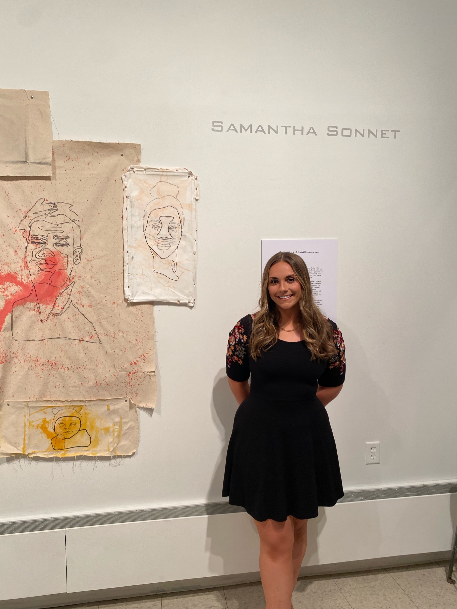
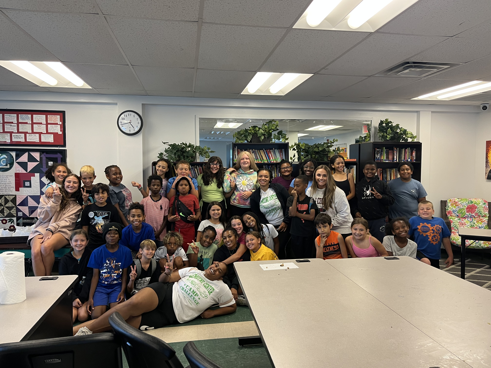

| [Main Page](/README.md) | [Part One](/finalproject.md) | [Part Two](/finalprojectparttwo.md) | [Part Three](/finalprojectpartthree.md) |

# Final Project Part Three
## The final data story
> [Southwestern PA Arts Education](https://preview.shorthand.com/15upZj4yLYDpfGFJ)

Focusing on Inequities in K-12 Educational Systems

## Changes made since Part II
> The feedback from Part II helped me greatly to realize that I needed to bridge the gap between what I knew from my research (and forgot was not common knowledge) and what the intended audience knew. Because of this, I decided to create a storyboard from scratch on Shorthand that created a linear, impactful story. It was also my intention to explain WHY I felt it necessary to tell the story given my background not only as an arts manager, but also as a student who grew up in the Southwestern PA arts education ecosystem, as someone who knows firsthand what it was like. A main change that I decided to implement was the inclusion of a new graph entitled "County Breakdown" to better explain the point that I was trying to make concerning the automatic disadvantage that Title I schools face. This graph compares the concentration of percentage of Title I schools per county with the percentage of poverty rates, non-white residents, and higher education degrees obtained. This graphic was able to show that the counties with the lower amount of Title I schools overwhelmingly have a higher percentage of residents with higher education degrees, and a lower poverty rate compared to the other counties.

## The audience
> The intended audience for this story are school administrators, activists, and any student or educator directly affected by these inequities. I think that the information presented in my final Shorthand could be used as a reference for anyone trying to obtain additional funding or resources for arts inequities. I was able to gather from my interviews, specifically from the interviews conducted with Title I and Non-Title I educators, that this information would potentially be helpful to take to their school to show the inequities that currently exist. I made sure to cater the entire Shorthand presentation to an audience assuming that although they MAY know a lot about the arts education ecosystem in SWPA, that this may not necessarily be the case. Because of this, I decided to include all the background information necessary to make this information as accessible to as many groups of people as possible.

## Final design decisions
> 
> You can specifically break out your design decisions here, or include it under *Changes made since Part II* and delete this section. Talk about the design decisions you had to make along the way, and reflect on anything in particular that stands out to you that you learned working through the process.  Include any other information that helps round out your data story. 

Text here!

## References
“Arts Vibrancy Map: 2022 Edition: SMU DataArts,” DataArts, accessed November 21, 2023, [Link](https://dataarts.smu.edu/ArtsVibrancyMap/)

"Title 1 Status for Public Schools in Pennsylvania Counties," ZipDataMaps, accessed November 21, 2023, [Link](https://www.zipdatamaps.com/counties/state/education/map-of-percentage-of-title-1-status-public-schools-for-counties-in-pennsylvania)

"artlook® SWPA," Arts Ed Collaborative, Accessed November 21, 2023, [Link](https://artsedcollab.org/artlook/)

"QuickFacts: Pennsylvania," U.S. Census Bureau, Accessed November 21, 2023, [Link](https://www.census.gov/quickfacts/fact/table/PA/PST045222)

"Donors Choose," Donorschoose.org, Accessed November 21, 2023, [Link](https://www.donorschoose.org)

"NATIONAL CORE ARTS STANDARDS," PA Department of Education, Accessed December 5, 2023, [Link](https://www.stateboard.education.pa.gov/Documents/Regulations%20and%20Statements/State%20Academic%20Standards/Arts.pdf)

“ChatGPT,” OpenAI, Accessed December 5, 2023, [Link](https://chat.openai.com)

“What is a title I school?” We Are Teachers, May 17, 2023, [Link](https://www.weareteachers.com/what-is-a-title-i-school/)

“Find Your Legislator,” PA General Assembly, Accessed December 5, 2023, [Link](https://www.legis.state.pa.us/cfdocs/legis/home/findyourlegislator/)

“PA State Resources,” PA Department of Education, Accessed December 5, 2023, [Link](https://www2.ed.gov/about/contacts/state/pa.html)

“PA Arts Education Data Project,” PA Department of Education, Accessed December 5, 2023, [Link](https://www.education.pa.gov/Teachers%20-%20Administrators/Curriculum/ArtsHumanities/Pages/default.aspx)

“Apply for a Grant,” PA Council on the Arts, Accessed December 5, 2023, [Link](https://www.arts.pa.gov/WHAT%20WE%20DO/FUNDING/apply-for-a-grant/Pages/default.aspx)

“Pennsylvania,” National Endowment for the Arts, Accessed December 5, 2023, [Link](https://www.arts.gov/impact/state-profiles/pennsylvania)

## Final thoughts
> I felt that it was important to show the personal connection that I had to this topic as an arts manager, alumni of the SWPA arts education ecosystem, a visual artist, and someone deeply invested in equitable opportunity for all children. Working as a Camp Counselor for a group of low-income PreK-12 students really impacted me, and those students that I worked with changed me forever. I grew bonds with many children and did not expect how much meeting them would impact my decision making and activism efforts in the future. Because of my experience at Camp Challenge, I can confidently say that equitable resources in education have become of extreme importance to me, acknowledging that I grew up extremely privileged and never needed to worry about insecurity concerning access to my educational experiences. I was fortunate enough to have expensive resources like a kiln at my school, and was also lucky in the sense that I was mentored by my mother who had graduated from the Arts Institute of Pittsburgh. Working in the camp showed me that many kids, even those who live 15 minutes down the road from me, do not have the same resources that I do, and I believe it to be my mission to work hard to address those disparities as best as I can.
>
> 
> Overall, I thoroughly enjoyed this project and the skills that it taught me. I am also happy that I was able to create something that I am so passionate about, and that I have something to look back at and be proud of as a reflection of the class. I feel that Shorthand was very intuitive to use, and I actually thought it was quite fun to create our final deliverable. I have learned through this class that I am not exactly the biggest fan of Tableau, as I thought it would be easier to use. However, I was able to make my visualizations work and create supporting visuals from Canva as well. If I had more time to do this project, I would most likely take time to interview more educators and administrators to understand their personal experiences in SWPA to better tell my story. In general, though, I think that my story is effective and meaningful!

Me at my senior art show!

Me with my 4th and 5th grade class at Camp Challenge!
