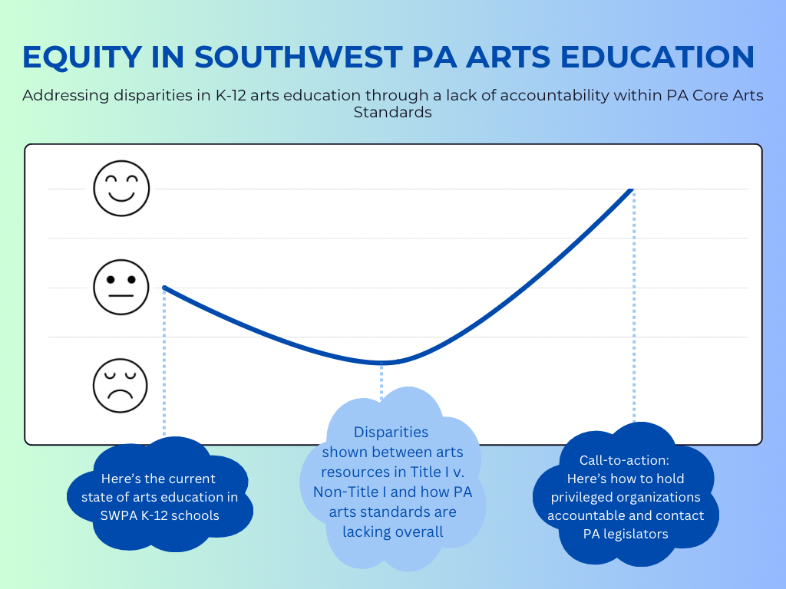
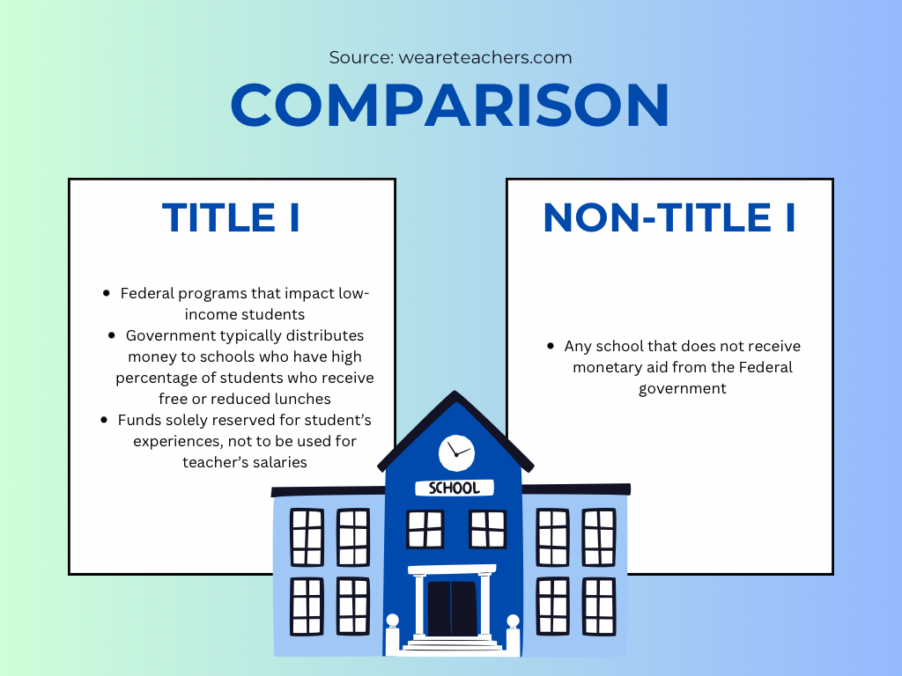

| [Main Page](/README.md) | [Final Project Part One](/finalproject.md) |

# Final Project Part Two
## Beginning Shorthand Layout
[Click Here!](https://preview.shorthand.com/15upZj4yLYDpfGFJ)

Although not finished, this beginning layout for my shorthand project will be expanded upon as I continue to gather all the necessary information that I need to tell the story in the best manner possible.
## Wireframes / Storyboards
### Visualization One

> This image shows the flow of the structure of the story I am going to tell concerning equity in Southwestern PA arts education, specifically addressing the disparities in K-12 arts ed through a lack of accountability within PA Core Arts Standards. I will begin by presenting the reader with the current situation of Southwestern PA K-12 schools, Title 1/Non-Title 1, etc. and then move onto the disparities shown between arts resources in Allegheny (and other urban) counties compared to the other remaining counties of the 13 total. I will also discuss more about how the PA arts standards are overall lacking. Finally, I will end with a call-to-action concerning how to hold privileged organizations/schools/funders accountable and how to contact PA legislators to make things better.

### Visualization Two

> This is a visualization I decided to add to better distinguish the categorizations of Title I v. Non-Title I schools for the reader.

### Visualization Three

<noscript></noscript><object class='tableauViz'  style='display:none;'><param name='host_url' value='https%3A%2F%2Fpublic.tableau.com%2F' /> <param name='embed_code_version' value='3' /> <param name='site_root' value='' /><param name='name' value='SouthwesternPAArtsVibrancyTitleISchools&#47;Sheet1' /><param name='tabs' value='no' /><param name='toolbar' value='yes' /><param name='static_image' value='https:&#47;&#47;public.tableau.com&#47;static&#47;images&#47;So&#47;SouthwesternPAArtsVibrancyTitleISchools&#47;Sheet1&#47;1.png' /> <param name='animate_transition' value='yes' /><param name='display_static_image' value='yes' /><param name='display_spinner' value='yes' /><param name='display_overlay' value='yes' /><param name='display_count' value='yes' /><param name='language' value='en-US' /><param name='filter' value='publish=yes' /></object>
                

> This is a map that is similar to the original SMU Data Arts Vibrancy Map, yet expands on it by adding in factors of Title 1/Non-Title 1 school percentages and total schools in that respective county, which are then complimented with the various other index levels of Arts Providers, Arts Dollars, Public Support, Socio-Economic Status, and Overall Index.

### Visualization Four

<noscript></noscript><object class='tableauViz'  style='display:none;'><param name='host_url' value='https%3A%2F%2Fpublic.tableau.com%2F' /> <param name='embed_code_version' value='3' /> <param name='site_root' value='' /><param name='name' value='ComparisonsBetweenTitleIandNon-TitleISchoolResources&#47;Sheet1' /><param name='tabs' value='no' /><param name='toolbar' value='yes' /><param name='static_image' value='https:&#47;&#47;public.tableau.com&#47;static&#47;images&#47;Co&#47;ComparisonsBetweenTitleIandNon-TitleISchoolResources&#47;Sheet1&#47;1.png' /> <param name='animate_transition' value='yes' /><param name='display_static_image' value='yes' /><param name='display_spinner' value='yes' /><param name='display_overlay' value='yes' /><param name='display_count' value='yes' /><param name='language' value='en-US' /><param name='filter' value='publish=yes' /></object>
                

> This visualization uses data from the U.S. Census Bureau and Donorschoose.org to show a few (of the many) disparities that exist between Title 1/Non-Title 1 K-12 schools by using metrics of % BIPOC students, % free/reduced lunches, % teachers to students ratio, and % in poverty.

## User Research 

### Target Audience
> My target audience is anyone who is personally affected by the K-12 arts education sector in Southwestern Pennsylvania, specifically students, educators, parents, artists, arts organizations, policy makers and educational advocates. I purposely interviewed one educator from a Southwestern PA Non-Title I School as well as one from a Title I School to get their perspectives on if I am telling the story in a relevant manner. 

### Interview Script
> 1. What do you think the story is that I am trying to tell?
> 2. Who is the intended audience for this?
> 3. Does anything particularly surprise you?
> 4. As an educator (I plan to interview at least one educator from a Title I school and one from a Non-Title I school)/student alumni/parent of this educational system, do these statistics resonate with you and your personal experience?
> 5. Are you left with any questions after reading all of this?

### Interview Findings
> #### Non-Title I Middle School Educator, Female, 30s:
##### What do you think the story is that I am trying to tell?
"I believe the story you’re trying to tell is that we need to put equal amounts of art resources in all schools (Title I or Non-Title I)"
##### Who is the intended audience for this?
"The audience is anyone who is affected by arts education in schools. I feel the data would be most suitable for the administrators of the schools, as well as members of the state government. They should see that funding is needed and changes should be made."
##### Does anything particularly surprise you?
"I am not surprised by the discrepancies presented. Art education as a whole is not a focus, especially when funding is low."
##### As an educator (I plan to interview at least one educator from a Title I school and one from a Non-Title I school), do these statistics resonate with you and your personal experience?
"I believe art education is important for all learners. Having art classes in schools allows the students to express themselves and learn a variety of techniques that can help them beyond the classroom. The fact that not all art programs are equal means that not all students are learning equally no matter what school they attend."
##### Are you left with any questions after reading all of this?
"I would be interested to learn more about how the funding is determined and why some feel that art education is not a priority."

> #### Title I High School Educator, Male, 30s:
##### What do you think the story is that I am trying to tell?
"I think your presentation is highlighting a disparity of art resources between Title I schools verse Non-Title I schools. I think you’re also implying that though non-title I schools have the appropriate resources, their art standards are still lacking overall. In addition, to combat the lack of art education resources within title I schools, you’re imploring that we contact our local legislatures; however, to address to lack of appropriate art standards in non-title I schools, you’re imploring that we hold these privileged organizations and schools more accountable."
##### Who is the intended audience for this?
"I believe the intended audience are administrative personnel and school board members of Title I and Non-Title I school districts, plus privileged organizations."
##### Does anything particularly surprise you?
"I’m surprised that Non-Title I schools aren’t doing a better job using their available resources to highlight art education. I understand that art isn’t a state tested subject, however, these schools still have the resources to adhere to the art education standards at an exemplary level."
##### As an educator (I plan to interview at least one educator from a Title I school and one from a Non-Title I school), do these statistics resonate with you and your personal experience?
"I’m a teacher at a Title I institution so these statistics absolutely resonate with me. Most of our Title I fund is used on other resources we deem more important than art and/or are state tested. Because we’re already limited on resources, we tend to dedicate most of those resources to the subjects that are state tested."
##### Are you left with any questions after reading all of this?
"I’m curious as to why Non-Title I schools and more privileged organizations are not investing more in art education?"

> #### Student Alumni of Southwestern PA Education System, Female, 20s:
##### What do you think the story is that I am trying to tell?
"These graphs show a clear difference between the mentioned categories of Title I and Non-Title I schools in the area. The education system is not providing a learning opportunity for students, especially in the arts field."
##### Who is the intended audience for this?
"I think this could go two ways: on one hand, the audience would be the school systems to bring evidence that they need to do better, and on the other hand, parents, teachers and administrators are the audience and this gives them some of the information to stand up and make changes."
##### Does anything particularly surprise you?
"To be honest, none of this information surprises me."
##### As a student alumni of this educational system, do these statistics resonate with you and your personal experience?
"My experience was likely better than others with the opportunities that were provided for us in the arts, but I definitely think that there are improvements to be made. For teachers, students, and everyone in education, we should try to bring as many opportunities as possible."
##### Are you left with any questions after reading all of this?
"How can we move forward and make a difference to create equal learning opportunities for everyone?"

> #### Parent of a (not affiliated above) Student Alumni of Southwestern PA Education System, Male, 50s:
##### What do you think the story is that I am trying to tell?
"Title 1 is not addressing the arts properly for underprivileged schools."
##### Who is the intended audience for this?
"The intended audience is activists concerned about these disparities and those most adversely affected by them."
##### Does anything particularly surprise you?
"Government assistance is inadequately addressing arts education."
##### As a parent of a student alumni of this educational system, do these statistics resonate with you and your personal experience?
"As a parent, while I cannot relate to the experience, I am appalled at them."
##### Are you left with any questions after reading all of this?
"Not really, other than I’m not sure what a BIPOC student means."

## Identified Changes for Part III
> The following are changes I plan to make for the creation of Part Three of the final project.

> ### Research synthesis
1. Show the disparities that exist by using data from my selected sources.
2. Be more clear on my explanations and simplify my explanations. 
3. Use shorthand to tell a linear story.                 
> ### Anticipated changes for Part Three
1. Use testimonials from those who are members of the intended audience and use compelling statistics.
2. Make sure to define acronyms, I cannot assume all people know what I do.
3. Set the story to frame the narrative for a more accessible story that all people can connect to.
